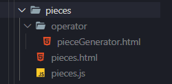

### Come inserire un nuovo component

Ogni nuovo component viene creato all'interno della cartella components.

Path: public\components

1. Creare una nuova cartella con il nome del component. Esempio "*pieces*".
      - Creare un file .html e un file .js con il nome del component.
      
          Esempio "*pieces.html*" e "*pieces.js*".
          
      - Creare una nuova cartella con il nome “operator” che conterrà la view dell'operatore.
       
         Nuovo file: "*pieceGenerator.html*"
         
         La struttura è la seguente:
         
         

2) I vari components del progetto presentano in generale questa struttura, che a seconda delle funzionalità del component, verrà modificata:

```javascript
components.push(async () => {
   Vue.component('pieces', {
      props: [],
      data: () =>{
         return {}
      },
      computed:{
       isOperator: function () {
        return localStorage.getItem('roleLogged').toUpperCase() === 'O' ? true : false;
         },
         location: function () {
            return this.$route.name;
         }
      },
      methods: {},
      components: {
         'piece-generator': pieceGenerator 
      },
      created:async function () {
       },
template: await $.get('components/pieces.html')
   })
});
```


I Parent Components contengono i child components. Qui il component "*pieces*" contiene il child component "*piece-generator*".
```javascript
components: {
      'piece-generator': pieceGenerator 
}
```

Il file "*pieces.js*" alla fine, dovrà avere questa struttura:

```javascript
let pieceGenerator = async () => {
   return {
      data: () => {
         return {}
      },
      computed: {},
      created: async function () {},
      template: await $.get('components/pieces/operator/pieceGenerator.html')    
   }
};
components.push(async () => {
   Vue.component('pieces', {
      props: [],
      data: () =>{
         return {}
      },
      computed:{
         isOperator: function () {
            return localStorage.getItem('roleLogged').toUpperCase() === 'O' ? true : false;
         },
         location: function () {
            return this.$route.name;
          }
      },
      methods: {},
      components: {
         'piece-generator': pieceGenerator 
      },
      created:async function () {},
      template: await $.get('components/pieces.html')
   })
});


```


 3) A questo punto bisogna spostarsi nel file "*router.js*" per inserire il nuovo component e il child component appena creati.

Esempio "*router.js*": 

```javascript
 {
   path: '/pieces', name: 'pieces', component: Vue.component('pieces'),
   children:
    [
      {path: 'piece-generator', name: 'piece generator', component: Vue.component('pieces')}
    ]
  }

```


4) All’interno del file "*pieces.html*" verrà scelto il template in base alle condizioni presenti nel v-if:

```html
<template v-if="isOperator">
      <template v-if="location == 'piece-generator'">
         <piece-generator></piece-generator>
      </template>
</template>
<template v-else>
...
</template>

```


5) Creare il collegamento del component tramite un button nella homepage desiderata.

Esempio nella homepage "*endPortioned.html*"

```html
<div class="row">
      <div class="col-12 mrg-btn">
         <button type="button" class="btn btn-new">
            <router-link class="route":to="{name: 'piece-generator'}">
               <span class=""><i class="fas fa-box"></i></span>
               <div>Genera Pezzi</div>
            </router-link>
         </button>
      </div>
 </div>


```

6) In fine, inserire nel file "*pieceGenerator.html*" il contenuto desiderato.

"*pieceGenerator.html*":

```html
<div class="row-margin">
   <div class="container-fluid cg-oper-font">
      <form>
          <div class="row mb-5 mrg-btn">
            <div class="col-12 text-center">Genera Pezzi</div>
          </div>
         <div class="row mrg-btn mb-5">
            <div class="col-12 text-center">
               <div>Gruppo Attivo:</div>
               <input type="text" class="form-control-c texcenter":value="activeGroup" readonly>
            </div>
         </div>
	</form>
    <div>
<div>

```


